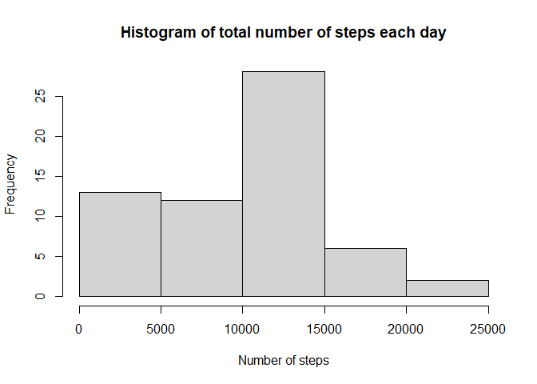
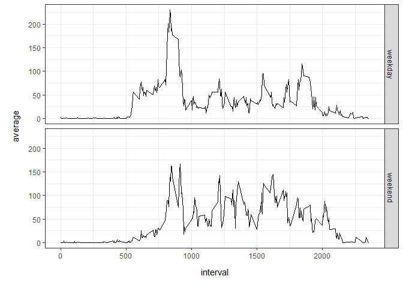

## Loading and preprocessing the data

```r
library(dplyr)
```

```
## 
## Attaching package: 'dplyr'
```

```
## The following objects are masked from 'package:stats':
## 
##     filter, lag
```

```
## The following objects are masked from 'package:base':
## 
##     intersect, setdiff, setequal, union
```

```r
library(ggplot2)
download.file("https://d396qusza40orc.cloudfront.net/repdata%2Fdata%2Factivity.zip", destfile= "C:/Users/overb/OneDrive/Bureau/Coursera/Data Science Specialization/Reproducible Research/Week 2/Assignment/db.zip")
unzip("db.zip")
db <- read.csv("activity.csv")
# changing dates to Date format
db$date <- as.Date(db$date)
```

## What is mean total number of steps taken per day?

```r
sumdb <- db %>%
  group_by(date) %>%
  summarise(sum = sum(steps, na.rm = T))
```

```
## `summarise()` ungrouping output (override with `.groups` argument)
```

```r
hist(sumdb$sum, main= "Histogram of total number of steps each day", xlab= "Number of steps")
```

<!-- -->

```r
paste("Mean:", mean(sumdb$sum), "and median:", median(sumdb$sum),"of number of steps each day")
```

```
## [1] "Mean: 9354.22950819672 and median: 10395 of number of steps each day"
```

```r
png("Fig1.png")
hist(sumdb$sum, main= "Histogram of total number of steps each day", xlab= "Number of steps")
dev.off()
```

```
## png 
##   2
```
## What is the average daily activity pattern?

```r
meandb <- db %>%
  group_by(interval) %>%
  summarise(average = mean(steps, na.rm = T))
```

```
## `summarise()` ungrouping output (override with `.groups` argument)
```

```r
with(meandb, plot(interval, average, type= "l"))
```

<!-- -->

```r
paste("Interval:",which.max(meandb$average), "with maximum number of steps:", max(meandb$average))
```

```
## [1] "Interval: 104 with maximum number of steps: 206.169811320755"
```

## Imputing missing values

```r
NAs <- db[is.na(db$steps), ]
paste("Number of missing rows:", length(row.names(NAs)))
```

```
## [1] "Number of missing rows: 2304"
```

```r
#Adding average number of steps for each interval and substituting NAs by average
newdb <- db %>%
  group_by(interval) %>%
  mutate(average_steps= mean(steps, na.rm = T)) %>%
  mutate(new_steps= ifelse(is.na(steps), average_steps, steps))
newdb <- newdb[,c(2,3,5)]

#Redo histogram of total number of steps
sumdb <- newdb %>%
  group_by(date) %>%
  summarise(sum = sum(new_steps))
```

```
## `summarise()` ungrouping output (override with `.groups` argument)
```

```r
hist(sumdb$sum, main= "Histogram of total number of steps each day", xlab= "Number of steps")
```

<!-- -->

```r
paste("Mean:", mean(sumdb$sum), "and median:", median(sumdb$sum),"of number of steps each day with imputed missing values")
```

```
## [1] "Mean: 10766.1886792453 and median: 10766.1886792453 of number of steps each day with imputed missing values"
```

```r
png("Fig2.png")
hist(sumdb$sum, main= "Histogram of total number of steps each day", xlab= "Number of steps")
dev.off()
```

```
## png 
##   2
```

## Are there differences in activity patterns between weekdays and weekends?

```r
weekdb <- newdb %>%
  mutate(wkd = ifelse(weekdays(date)== "Saturday"| weekdays(date)=="Sunday", "weekend", "weekday")) %>%
  group_by(interval, wkd) %>%
  summarise(average = mean(new_steps))
```

```
## `summarise()` regrouping output by 'interval' (override with `.groups` argument)
```

```r
weekdb$wkd <- factor(weekdb$wkd)
ggplot(weekdb, aes(x= interval, y= average)) + geom_line() + facet_grid(weekdb$wkd~.)+
  theme_bw()
```

<!-- -->

```r
ggsave("Fig3.png")
```

```
## Saving 7 x 5 in image
```
